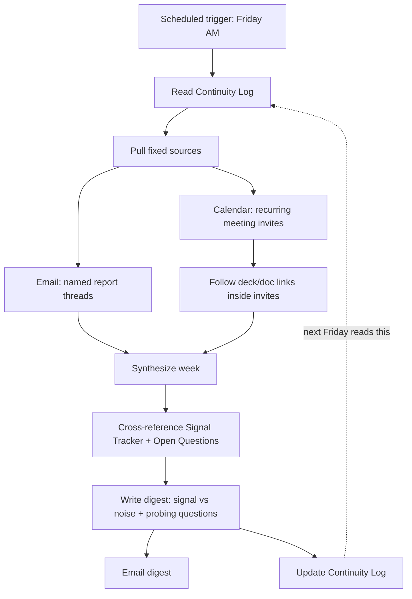

# The Friday Digest: Turning Scattered Reports into Institutional Memory

**A case study in using Claude to close the gap between "we have the data" and "someone actually looked at it."**

## The problem

Most marketing orgs have plenty of reporting: automated A/B test digests, weekly deck reviews, meeting notes, PR recaps. The problem was never a lack of data — it was that:

- Reports arrived on different cadences (daily, weekly, biweekly) from different tools (email, calendar invites, meeting notes), so nothing lived in one place
- Reading all of it, every time, didn't scale — so review became inconsistent
- Each report was a snapshot. Nothing connected *this week's* number to *last week's*, so slow-building problems looked like isolated blips every time
- Reports mixed pure data with actual insight, and it wasn't always obvious which parts of a report were signal and which were noise

The goal: one weekly digest that reads everything, remembers what it read last time, and tells me what actually changed — not a summary of every report.

## The approach

Three pieces, on purpose:

**1. A fixed source list, not keyword search.**
The first version of this tried to find "report-like" emails by matching subject lines against words like *report*, *weekly*, *update*. It worked about 60% of the time — a recurring 1:1 meeting invite with "weekly" in the title, an HR birthday email, and a cold sales email all matched just as well as the reports that mattered. The fix was boring but effective: name the actual sources (specific senders, specific recurring meeting titles) instead of guessing from text patterns. Deterministic beats fuzzy here.

**2. A continuity log the automation reads *before* it writes.**
Every run opens a living document with three parts:
- A **Signal Tracker** — a short table of things currently worth watching. A metric only earns a spot here after it moves meaningfully or repeats across 2+ periods. This is the actual noise filter: most weeks, most numbers don't graduate onto this list.
- **Open questions carried forward** — things flagged in a past digest that haven't been resolved. Each run checks whether new data answers any of them before generating new questions.
- **A dated log** — so "this is the third week this has come up" is something the system can actually say, not something I have to remember.

**3. Read the source, not the summary of the source.**
A lot of what matters was buried one layer deeper than the obvious text — a number in a slide deck linked from a calendar invite, not in the invite description itself. The task explicitly opens linked decks and documents rather than stopping at whatever text is directly visible. That's where the most interesting finding in the first real run came from (see below).

## Architecture

Built on **Claude with scheduled tasks** (Cowork), reading from connected Gmail, Google Calendar, and Google Drive. No custom backend, no cron server — the scheduling and execution both run on the platform.

## What it caught in week one

The dry run (before going live) surfaced something a human skim of the same inbox had missed: a paid ad campaign had spent five figures against a single conversion, framed internally as an "incrementality test." That framing wasn't wrong, but it was three clicks deep — inbox → calendar invite → linked deck → one summary slide. Buried under a 200%-month-over-month growth headline in the same deck, it's exactly the kind of thing that's easy to skim past and easy to regret missing.

That's the actual value proposition: not summarizing what you'd have read anyway, but surfacing the thing that's technically available but practically invisible.

## What I'd change next

- **Source drift**: the fixed source list needs a periodic human review — new recurring reports won't auto-enroll, which is the right tradeoff for reliability but means someone has to remember to add them.
- **Signal Tracker graduation criteria** could eventually be tuned per-metric (a 5% move means something different for conversion rate than for raw signup count).
- **Multi-recipient version**: right now this is a single-person digest. A team version would need to think about what's shared vs. individually relevant.

## Templates

- [`templates/scheduled-task-prompt.md`](templates/scheduled-task-prompt.md) — the generalized prompt, ready to adapt to your own sources
- [`templates/continuity-log-template.md`](templates/continuity-log-template.md) — the doc structure that gives the automation memory

---

*Built with Claude (Anthropic). If you're doing something similar, I'd genuinely like to compare notes — open an issue.*
